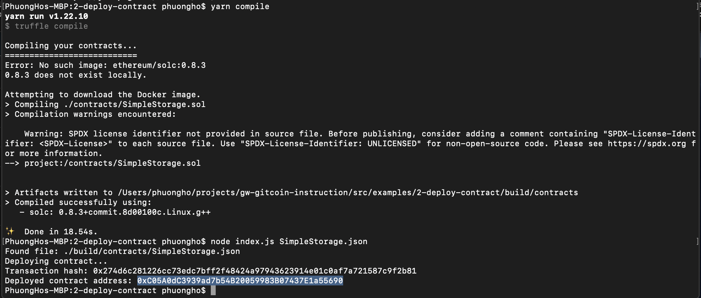

## 1. A screenshot of the console output immediately after you have successfully deployed a smart contract.

## 2. The transaction hash from the contract deployment (in text format).
0x274d6c281226cc73edc7bff2f48424a97943623914e01c0af7a721587c9f2b81
## 3. The deployed contract address from the contract deployment (in text format).
0xC05A0dC3939ad7b54B20059983B07437E1a55690
