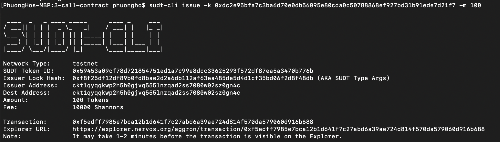
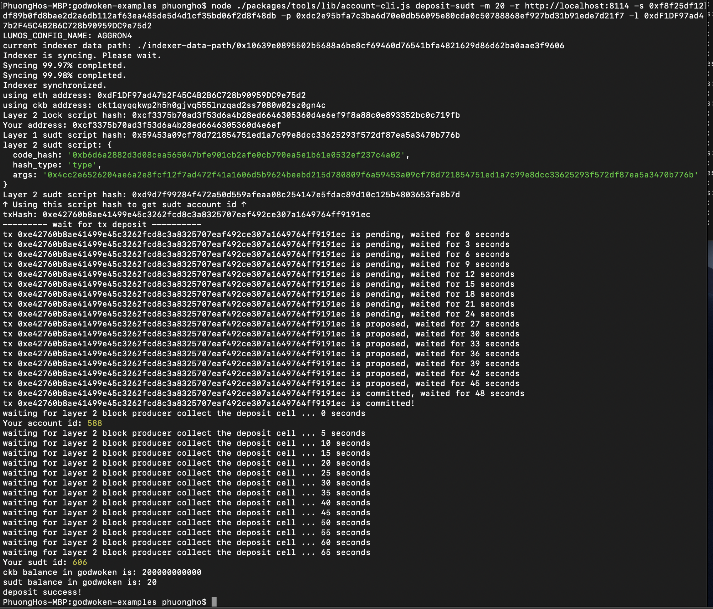

## 1. A link to the Layer 1 address you funded on the Testnet Explorer.
[https://explorer.nervos.org/aggron/address/ckt1qyqqqsy8q3s9ne5hckxa6juu3dylg3rt7zcsr4rmhu](https://explorer.nervos.org/aggron/address/ckt1qyqqqsy8q3s9ne5hckxa6juu3dylg3rt7zcsr4rmhu)
## 2. A screenshot of the console output immediately after using sudt-cli to create your SUDT tokens on Layer 1.

## 3. A link to the transaction ID created by sudt-cli on the Testnet Explorer.
[https://explorer.nervos.org/aggron/transaction/0xf58c66f9442443f17feb9bc8152a7af4d39dfd86fd864a25f40b1e626256f18f](https://explorer.nervos.org/aggron/transaction/0xf58c66f9442443f17feb9bc8152a7af4d39dfd86fd864a25f40b1e626256f18f)
## 4. A screenshot of the console output immediately after you have successfully submitted a deposit to Layer 2 using the account-cli tool.

## 5. The SUDT ID from the console output after executing the deposit script (in text format).
1115
